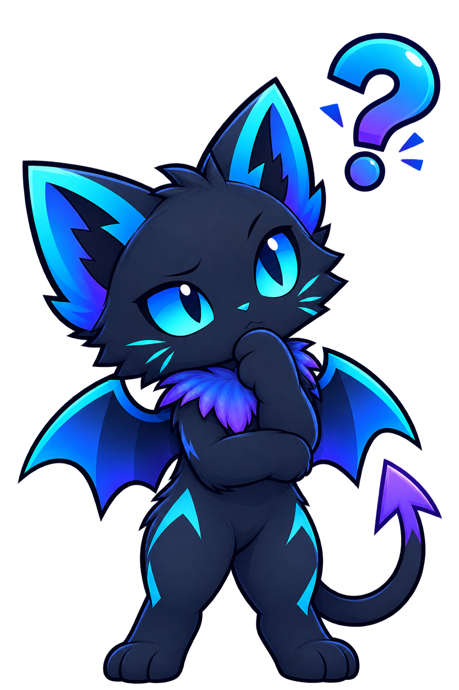
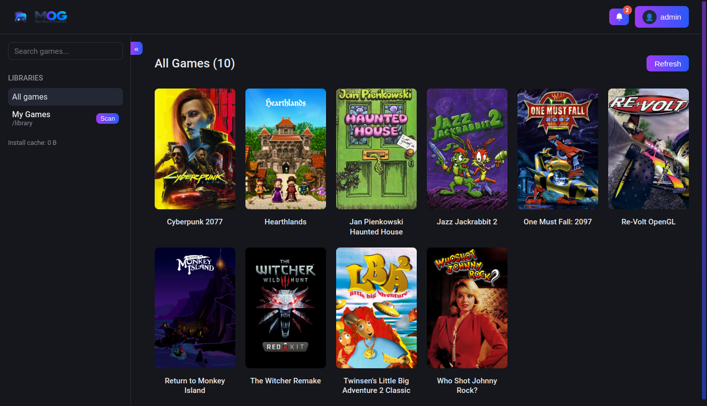
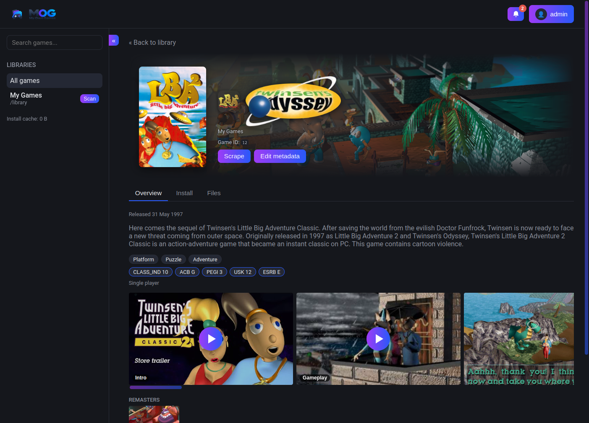
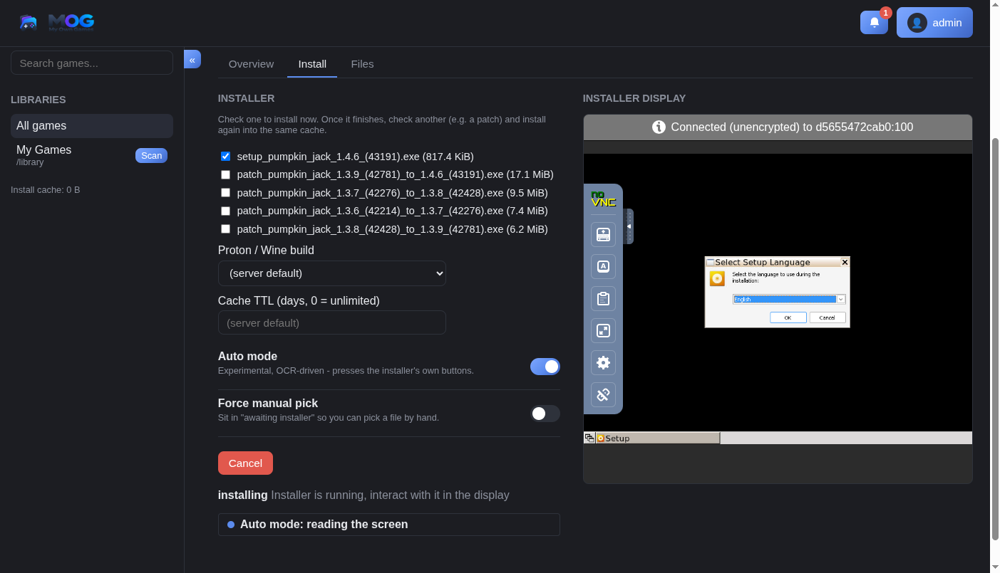
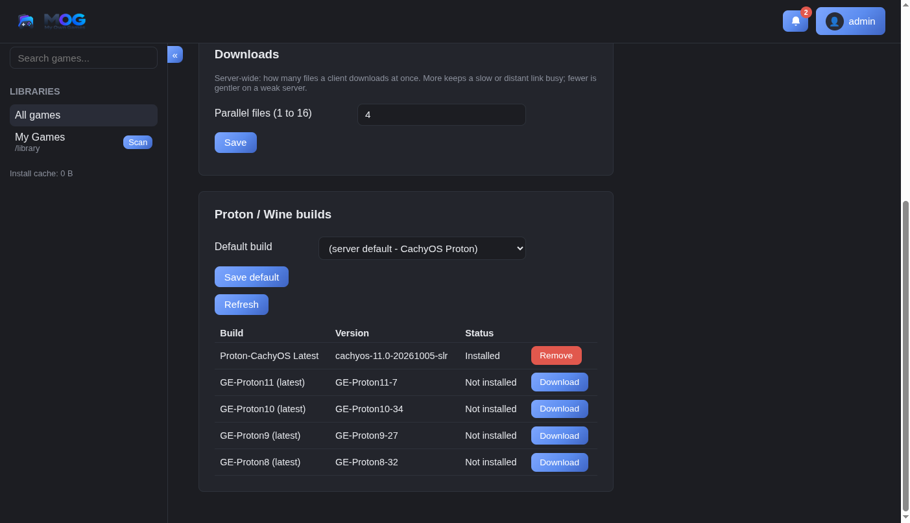
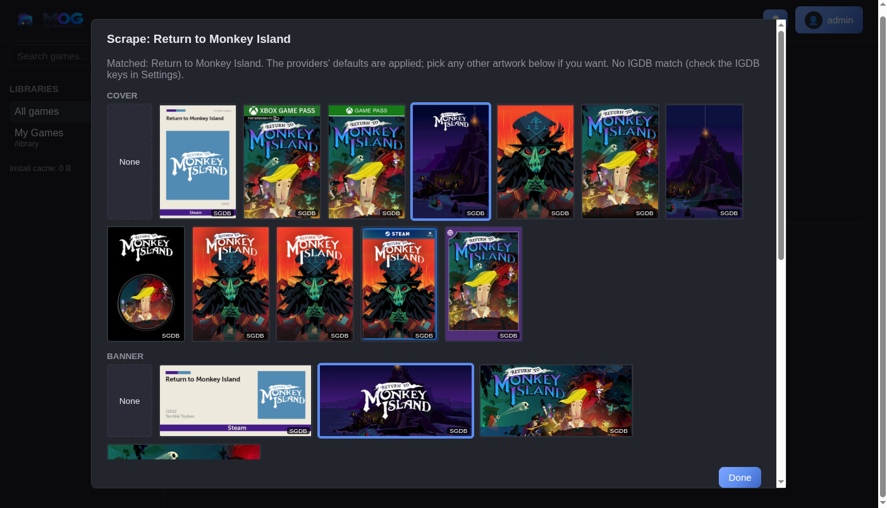
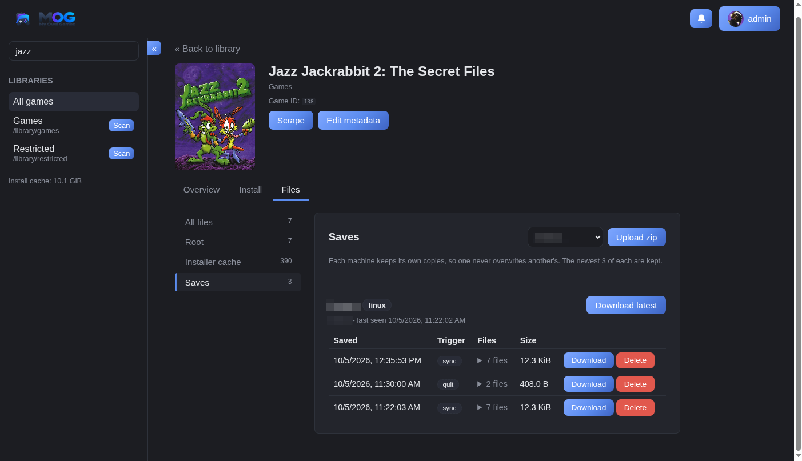
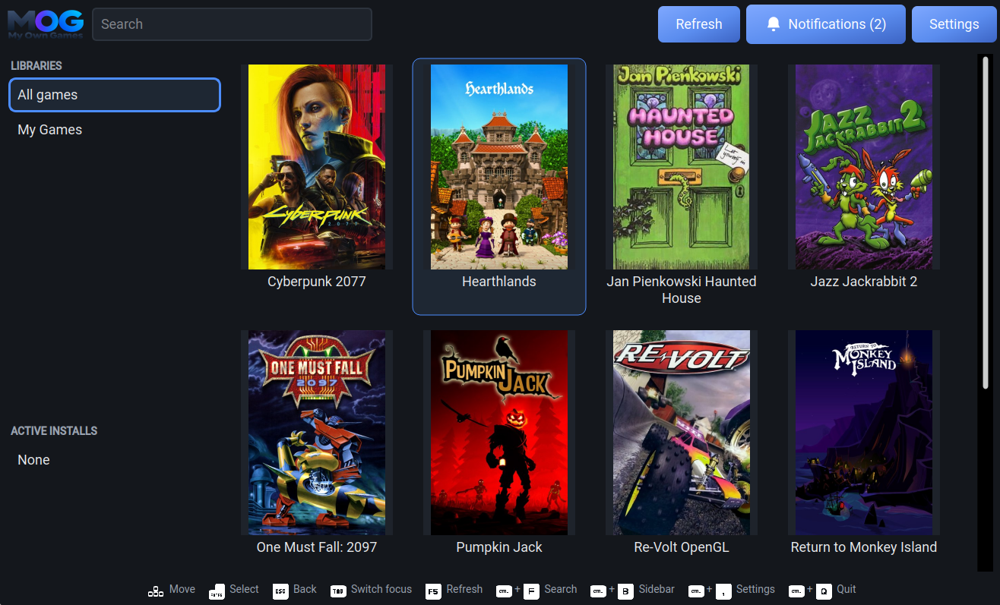
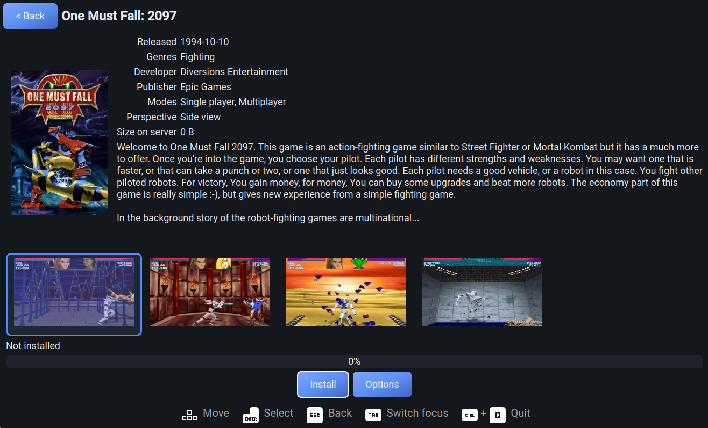
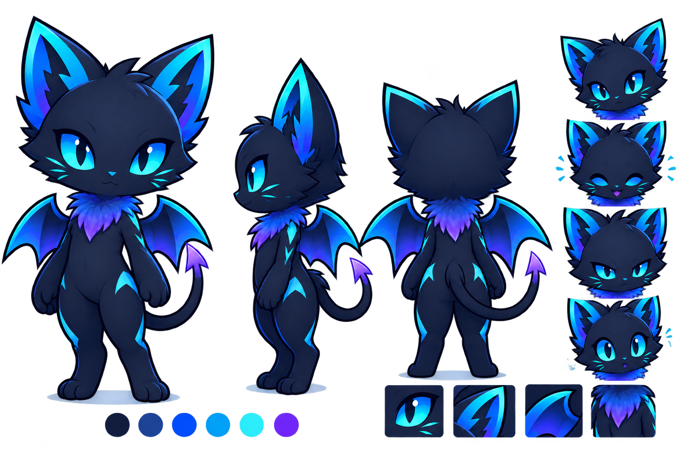

# MOG - My Own Games

**DISCLAIMER:** this project is vibe coded with a solid and continous human testing and hard human projecting and supervision.

**Keep and comfortably reinstall the PC game library you're entitled to.**

Ownership of software you've paid for is getting harder to exercise: storefronts shut down, DRM servers go dark, and a working installer from ten years ago can be genuinely difficult to get running again. MOG is a self-hosted way that is giving its own take on trying to solve that problem where possible: point it at a folder of installers, and it will scan them, fetch metadata, and install games into clean, isolated environments whenever you will click the install button in the same way a storefront client would.

Imagine having the same seamless experience as downloading a game from Steam or GOG Galaxy, except the games come from your own server, your own library, and remain under your control.

With MOG, installing a game is as simple as clicking **Install**. The MOG Server handles the installer for you, installs the game in its isolated environment, and streams the resulting files directly to the MOG Client. You don't need to interact with the original installer, configure compatibility options, or manually move files around: just click **Install**, wait for it to finish, and **Play**.

MOG is for games you own a legitimate copy of, and installers you are otherwise entitled to run. It is installer-format-agnostic: it drives whatever installer technology a title uses, generically, without requiring dedicated integration for each storefront or installer.
MOG does not seek out, catalog, or promote any particular source. You provide the installers; MOG takes care of the rest.

## What MOG does

Imagine you have a personal server, NAS, or another PC where you keep all the game installers you own.

**Without MOG**, installing one of those games on another device usually means:

1. Find the installer on your server.
2. Copy it to the target device.
3. Make sure you have enough free space for **both the installer and the installed game**.
4. Run the installer manually and configure the game.
5. Wait for the installation to finish.
6. Delete the installer to recover the temporary space.
7. Repeat the process whenever you want to install the game on another device.
8. Find a way to keep your save files synchronized between devices.

For large games, this can be particularly inconvenient. A game that takes **100 GB installed** may have an installer that takes another 80–100 GB, meaning you might need **almost twice the final game size** available on the target device during installation.
And not counting the time to transferring it to your local disk.

The target device also has to remain available while the installer is being copied and while the installation is running. You can't simply put it aside and let it sleep without potentially interrupting the process.

**MOG turns your installer collection into your own personal game storefront.**

Point MOG Server at your collection of installers and it will scan them, identify the games, retrieve their metadata, and make them available through MOG Client.

From there:

1. Open MOG Client.
2. Choose a game.
3. Click **Install**.

What MOG does then?
- MOG Server runs the original installer in an isolated environment.
- The resulting game files are streamed to your device.
- When it's finished, just **Play**.
- Your saves are uploaded to MOG Server!

MOG doesn't need to copy the entire installed game to the client only after the installer has finished. **Game files can be transferred to the client as they are produced during installation**, making the installation itself the data transfer process.

The server also keeps the resulting installation data in its **installer cache**. This means you choose how you want to use it: you can stream-install directly while the server is installing the game, or use the cached data later to install the same game on one or more other clients.

This also means **multiple clients can benefit from a single server-side installation** without requiring the original installer to be copied to every device. The server does the installer work once, keeps the resulting data available, and clients can consume it as needed.

The original installer stays on your server, so you don't need to copy it to every device or keep it alongside the installed game.

The Client is also designed for **unattended installations**. It can manage the installation in the background and use the appropriate power-management behavior for the platform.

On gaming handhelds such as the **Steam Deck**, the goal is to make this feel like a native Gaming Mode operation: start the installation, put the device aside, let the display turn off and the system enter its appropriate low-power state, and come back when the game is ready.

No manual installer. No temporary installer copy. No babysitting the installation.

And with **save synchronization**, your saves can follow you between devices too.

**Your installers stay on your server. Your games are installed where you want them. MOG takes care of the work in between.**

### How it fits together

## MOG Server
**[MOG-Server](https://github.com/MOG-My-Own-Games/MOG-Server)** - the self-hosted piece. Scans your
  library folders, fetches metadata (IGDB, SteamGridDB), and runs installers server-side inside a sandboxed
  Wine/Proton environment with a VNC view, so you can install (or stream-install) a game without needing a
  Windows machine or doing it by hand on every client.

### Screenshots

<table>
  <tr>
    <td align="center">
      
       
      <b>Game Library</b> 
    </td>
    <td align="center">
      
       
      <b>Game Overview</b> 
    </td>
  </tr>
  <tr>
    <td align="center">
      
       
      <b>Game Installation</b> 
      A containerized installer engine uses OCR to automagically install your games
    </td>
    <td align="center">
      
       
      <b>Wine / Proton</b> 
      Configure the environment used to run installers
    </td>
  </tr>
  <tr>
    <td align="center">
      
       
      <b>Metadata Scraper</b> 
      Automatically retrieve game metadata
      from metadata providers,
      allows user picked media
    </td>
    <td align="center">
      
       
      <b>Save Management</b> 
      Manage and synchronize game saves
    </td>
  </tr>
</table>

## MOG Client
**[MOG-Client](https://github.com/MOG-My-Own-Games/MOG-Client)** - We provide a simple GUi and CLI client that talks to a MOG-Server. Is available for Linux and Windows, however we encourage the developers to integrate MOG as a game provider in their related softwares.
The client is fully usable with a controller, comfortable for PC gaming handhelds such as Steam Deck.

### Screenshots

<table>
  <tr>
    <td align="center">
      
       
      <b>Game Library</b> 
    </td>
    <td align="center">
      
       
      <b>Game Details</b> 
    </td>
  </tr>
</table>

## Installation demo

## Where this came from

MOG began as a feature proposal for [RomM](https://github.com/rommapp/romm), a FOSS ROM manager, which
didn't take the feature into its own scope. MOG is a clean fork of that idea into its own project under its
own name - it shares no branding with RomM and isn't affiliated with it, though some server-side code is
adapted from RomM's AGPLv3-licensed source (credited in `NOTICE.md` in that repo, as the license requires).

## Getting started

Spin your own server via docker conainer and download the client.
Check the related repositories for full information.

## Support

MOG is free, and it will stay free. If you like it and want to chip in, you can buy me a coffee.

## What MOG is not

* **Game downloader:** MOG does not download games from Steam, GOG, Epic, or other storefronts. You provide the installers you already own.
* **Game library manager:** MOG keeps track of your library and the games it installs: it offers a basic interface with scraping and metadata, but comprehensive game collection management is not its purpose. Use [RomM](https://github.com/rommapp/romm) for a full multi-platform game library.
* **Game launcher:** MOG Client can launch installed games, but you can use any launcher or frontend you prefer. MOG is launcher-agnostic.
* **Game streaming service:** MOG streams installation data, not gameplay. Games run locally on the client.
* **Game storefront:** MOG does not sell, distribute, or provide access to games. There is no marketplace or game catalogue.
* **DRM bypass:** MOG does not crack games or remove DRM. It works with software and installers you are legitimately entitled to use.
* **Compatibility layer:** MOG is not a replacement for Wine, Proton, or other compatibility technologies. It uses the environment available on the target system to run Windows games.
* **An exposable server:** MOG is vibecoded and no security accessment was one on the code, so developers cannot ensure security. The developers highly suggest to **do not expose it on the internet**, keep it in the safe network of your LAN.
Devlopers do not support such usage nor taking responsabilities for the use of this software.

## Developer integrations

MOG is designed to work alongside other software, not replace it. We encourage developers of game managers, launchers, frontends, and other related tools to integrate **MOG as an installation provider**.
This allows your software to handle the library and user experience while delegating game installation and management to MOG. If your project could benefit from letting users install games from their own MOG Server, we'd love to see an integration.

## Meet Mog

This is **Mog**, the mascot of the software of the same name, **MOG**.
She's a **gamer cat-bat**: part cat, part creature of the night, and 100% obsessed with video games.
Feel free to draw and share **fan art of Mog**! So we'd love to see what you come up with.

## Licenses

MOG-Server is licensed under **AGPLv3**.

MOG-Client is licensed under **GPLv3**.

**Mog**, the MOG mascot, is released under a **Creative Commons license**. Fan art is welcome, provided it is not used to impersonate official MOG communications, promote hate or discrimination, or for political propaganda.

 See each repository for details.
